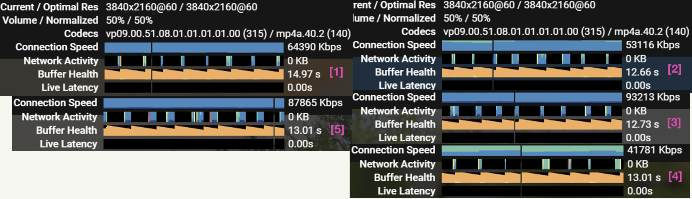
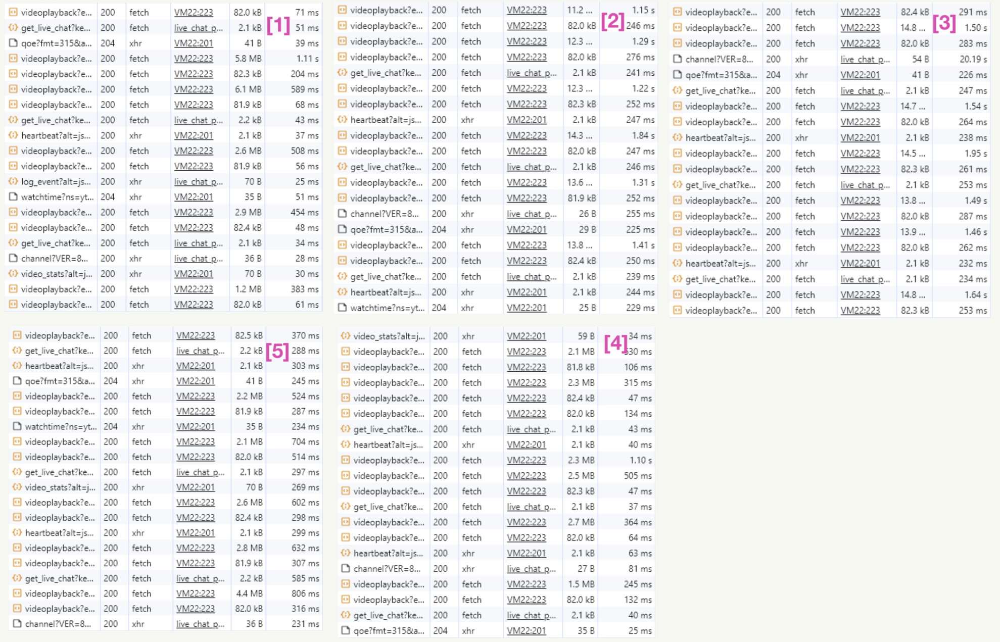

# Analysis of Streaming Protocols in YouTube Video Transmission Performance and Quality Assessment

Nowadays, online video streaming has become a fundamental application of multimedia systems, and its
quality and experience depend on two key factors: decoding capability and network environment. These
factors are crucial in terms of loading speed, frame quality, and effective utilization of bandwidth. On the other
hand, for modern computers, the GPUs provide major video decoding capabilities. Therefore, this project aims
to provide a comprehensive assessment of the network environment and GPU decoding capability applicable
to YouTube video transmission.


This study relies on both controlled experiments and real-world testing to offer a comprehensive analysis.
Analyzing objective performance data paints a comprehensive picture of how the network environment and
GPU decoding capability influence streaming quality and the user experience.

## INTRODUCTION
In the modern era of digital communication, online video content revolutionizes the way we access
and consume multimedia. Platforms like YouTube emerge as ubiquitous sources of information,
entertainment, and education, seamlessly delivering video content to a global audience. However,
the seamless and high-quality experience that users enjoy is not a mere coincidence but the result
of a complex interplay of technology, infrastructure, and protocols.

On another front, the physical network infrastructure bears the responsibility of carrying and
transporting these protocols. A multitude of servers and backbone networks transmit video data to
end-users with the assistance of transmission protocols. Given that network devices operate in
the real world, packet loss, latency, and limited bandwidth are inevitable. These circumstances can
significantly impact both the transmission process and the quality of the video.

Additionally, the process of translating transmission protocols and compressed data into signals
perceptible by human senses is a significant undertaking. In this context, video decoding holds
particular importance, especially in terms of decoding speed and quality. For modern computers,
the GPU takes the most of the workload. It’s noteworthy that, with the rapid advancement of
technology, both the performance and prices of GPUs have significantly increased. This situation
has led to the continued use of some older devices that have not been phased out. The question
arises as to whether these GPUs can keep pace with the progress in modern video technology,
specifically concerning aspects such as playing 4K or higher resolution videos.

In conclusion, the video experience for end-users is significantly influenced by both the network
environment and GPU performance. Therefore, the objective of this project is to conduct a comprehensive evaluation of YouTube video streaming performance and quality by analyzing various
factors that impact the viewing experience. This research is crucial due to the increasing reliance
on online video content and the need for optimized video streaming technologies. The factors to be
investigated include:

• Network environment parameters (latency and packet loss)
• Live or Stored Video
• GPU performance
• Video quality(4K-8K)

While various studies are exploring aspects of video streaming performance, there is limited
research that combines GPU decoding, network parameters, video quality, and codec analysis
within a controlled virtual environment. Previous efforts often focus on isolated factors or lack
comprehensive assessments.

The approach involves setting up a simplified hardware environment to manipulate and monitor
selected variables, including GPU decoding performance: assembling the environment with different
GPU models. Standardized video streams are utilized to assess GPU decoding efficiency. Monitoring
tools measure GPU utilization, decoding speed, and potential bottlenecks. The evaluation also
utilizes tools similar to the tc (Traffic Control) tools for network parameter control. The final step 
involves storing videos and live streaming, divided into different control groups. Each control group is shown to four participants who watch for 10 minutes and then fill out a pre-prepared survey.
Finally, all survey responses are analyzed and evaluated.

## BACKGROUND
While YouTube, being one of the globe’s foremost video-sharing platforms, has been at the forefront
of enhancing the viewer experience through the judicious selection of appropriate streaming
protocols. In a bid to meet the diverse needs of its vast user base, YouTube has conducted extensive
experimentation with an array of protocols and adaptive streaming mechanisms. This endeavor
aims to ensure that video playback remains seamless and uninterrupted. Nonetheless, the choice of
the most suitable protocol is contingent on a multitude of factors, including prevailing network
conditions, the capabilities of the viewer’s device, and individual user preferences. Consequently,
YouTube’s approach to protocol selection is a dynamic and adaptive one, attuned to the ever-shifting
landscape of online video streaming.

## YouTube Transmission

YouTube employs a progressive download method for video transmission, allowing users to stream
content seamlessly. When a user initiates playback, the video file is delivered in small chunks,
with the first segment downloading immediately. Simultaneously, subsequent portions are fetched
in the background, ensuring a continuous stream while minimizing buffering interruptions. This
adaptive streaming technique adjusts the quality of the video based on the viewer’s internet speed,
guaranteeing a smoother experience. Additionally, YouTube employs various codecs to compress
and optimize video files for efficient transmission[9]

## Network Protocols
In the realm of online video websites like YouTube, the backbone of seamless streaming experiences
lies in specific network protocols. At the forefront is HTTP (Hypertext Transfer Protocol), which
facilitates the transfer of video content over the web. YouTube leverages HTTP-based protocols such
as HTTP Live Streaming (HLS) or Dynamic Adaptive Streaming over HTTP (DASH) to efficiently
deliver videos. These protocols enable YouTube to dynamically adjust the video quality based on the viewer’s internet speed, ensuring uninterrupted playback and a smoother streaming experience.
Additionally, HTTPS (Hypertext Transfer Protocol Secure) plays a pivotal role in securing the
transmission of video content, encrypting data exchanged between users and YouTube servers to
enhance overall security during video streaming.

In the context of live streaming on platforms like YouTube, Real-Time Control Protocol (RTCP)
and Real-Time Transport Protocol (RTP) come into play. RTCP provides valuable feedback on
the quality of the streaming session, aiding in the optimization of the viewer’s experience. This
combination of protocols not only ensures the efficient delivery of on-demand video content but
also contributes to the real-time adaptability required for live-streaming scenarios. For a deeper
understanding of the intricacies involved, one can explore technical documentation provided by
YouTube or delve into resources related to streaming protocols and online video delivery systems.

## RELATED WORK
### Low Latency Live Video Streaming over HTTP 2.0
In HTTP streaming, clients experienced latency due to the segment duration, making it unsuitable
for low-latency live streaming. Reducing segment duration, while a solution, led to increased HTTP
requests and inefficient cache usage. To address this, the study introduced a low-latency live video
streaming technique with HTTP 2.0. It actively streamed live video from the web server to the client
as soon as video segments were available. The approach was implemented in an MPEG-DASH
prototype. Experimental results showed improved live latency and addressed the request explosion
issue while reducing segment duration[8].

### Towards Optimal Low-Latency Live Video Streaming
The study presented an exploration of the low-latency live-streaming design space by developing
dynamic models and optimal adaptation strategies. These strategies aimed to establish upper
bounds on Quality of Experience (QoE) as a function of allowable end-to-end latency. To achieve
this, practical live streaming algorithms were developed within the frameworks of iterative Linear
Quadratic Regulator (iLQR)-based Model Predictive Control and Deep Reinforcement Learning[5].

### Content delivery networks: status and trends
Content Delivery Networks (CDNs) significantly enhanced network performance and application
reliability by strategically distributing content to cache servers located near users. The rapid growth
of the internet elevated the importance of speed, accuracy, and availability of web-delivered content.
Proxy servers played a crucial role in quick content delivery by providing shared cache locations
for multiple clients. CDNs acted as trusted overlay networks, efficiently delivering common web
objects, static data, and multimedia content by distributing the content load among servers close to
users. This approach reduced the origin server load, minimized latency for end users, and enhanced
overall throughput[1].

### Analysis of YouTube DASH Traffic
Efficient resource allocation algorithms, crucial for meeting users’ quality of service requirements,
relied on accurate knowledge or estimation of traffic characteristics. With video streams constituting
70% of internet traffic and on a continual rise, understanding the properties of these streams was
essential. This paper presented findings from a study on the characteristics of the most popular
videos on YouTube, a major contributor to video traffic. The study explored the impact of the
Dynamic Adaptive Streaming over HTTP (DASH) technology used by platforms like YouTube and
Netflix[4].

## RESEARCH STRATEGY
### Experimental Design:
Describe the experimental design, including protocol choices, network environment conditions
control, methods for measuring performance metrics, and the experiment schedule.

### Data Analysis:
Analyze the collected data using statistical methods to compare the performance of different
protocols and assess the significance of the results.

### Conclusion and Recommendations:
Summarize the main findings of the research, conclude the performance of different protocols, and
offer practical optimization recommendations.

### Real-life Testing and Survey:
Implementing experiments in real-world scenarios entails inviting participants to actively engage
and collect their feedback. Crafting tailored survey questionnaires serves the purpose of quantifying
user experiences effectively. The testing will involve separate evaluations for both live and stored
videos.

## RESEARCH METHOD
### Network Performance Testing
Experimental Environment Setup: Simulate network conditions, by setting up a Linux-based router
that allows the TC (Traffic Control) to configure a low bandwidth, high latency, and network
congestion, for the environment set up. Performance Metrics: Measure the latency, and stability of
each protocol under different network conditions. This can be achieved using network analysis
tools such as Wireshark or other performance testing tools[2].

1. Packet Loss Threshold. Packet loss can significantly impact the quality of video streaming.
In this phase of the research, we aim to determine the lowest acceptable packet loss rate that still
maintains a satisfactory user experience. The experimental setup will involve introducing varying
levels of packet loss while measuring the impact on video playback, buffering, and overall stability

2. Latency Threshold. Low latency is crucial for real-time interactions and a seamless streaming
experience. This investigation aims to identify the lowest acceptable latency levels for different
streaming protocols under diverse network conditions.

3. Bandwidth Threshold. The bandwidth threshold effect in online video refers to the critical
point at which available internet bandwidth significantly impacts the quality of streaming. Below
this threshold, users may experience issues such as buffering, reduced resolution, and interruptions.

### Live and Stored Videos

Live video streams events in real-time with immediate engagement, while stored video offers
on-demand access to pre-recorded content. Live video is dynamic, fostering a sense of community,
while stored video provides flexibility for users to watch at their own pace. Together, they enrich
the digital content landscape, serving diverse preferences and use cases.

## EXPERIMENTAL ENVIRONMENT ARCHITECTURE

### Hardware Explain:
1. Master Router: The router is used to
connect the local network to the local area network provider Shaw. It is responsible for signal
modulation and provides services such as DHCP
and packet transport for devices operating at
layer

2. Control PC:. The PC running in a Windows 10 environment is used for receiving signals from a capture card and sending commands
to the PC router in the experimental platform.
The commands include configuring and modifying Linux router settings, as well as adjusting
latency and packet loss rates.

3. Client Monitor: Providing video output for the participants in the experiment.

4. Capture Card: Used to replicate video signals and provide data to the software installed on
the Control PC.

6. PC Router: A PC running in an Ubuntu environment, installed with an SSH server for
remote login and control by the Control PC to achieve the experiment’s objectives. It also installed TC (Traffic Control) for configuring network latency and packet loss rates. One of the physical
network ports of this PC is directly point-to-point connected to a physical network port on the
Control PC, with manual configuration to ensure communication for SSH login. Another port of
this PC is connected to the Master Router, which provides IP and internet services through DHCP.
Meanwhile, TC is used to adjust parameters like latency and packet loss on this port. Finally, the
last port is connected to the Experiment PC to provide port forwarding for it.

7. Experiment Client: A PC running in a Windows 10 environment is used to test various
graphics cards, primarily through YouTube browsing. Additionally, this PC provides video output
to a monitor to provide data to the experimenters. This platform is temporary, allowing for the
convenient replacement of the GPUs and the platform includes:
• 6700k CPU
• 8G RAM
• Motherboard
• 1TB HHD
• PSU
• GPUs

### GPUs Introduction

1. Intel® HD Graphics 530: Intel® HD Graphics 530, part of the Skylake architecture (2015),
is an integrated GPU for lightweight computing tasks. Supporting DirectX 12 and OpenGL 4.4, it
offers hardware-accelerated video capabilities. Although not suited for high-end gaming, it provides
reliable performance for daily computing. Typically paired with Core i5 and Core i7 processors, it
enhances multimedia experiences. For the latest details, refer to Intel’s official documentation[3].

2. GeForce GT 1030: The GeForce GT 1030, part of NVIDIA’s Pascal architecture, is a budgetfriendly graphics card introduced in 2017. Designed for entry-level gaming and multimedia tasks,
it features 2GB GDDR5 memory, compact form factor, and low power consumption. While not
suitable for high-end gaming, it provides a cost-effective solution for users seeking improved performance over integrated graphics. For more detailed information, refer to NVIDIA’s official
website [7].

3. GeForce GTX 750 Ti: The GeForce GTX 750 Ti, part of NVIDIA’s Maxwell architecture
and released in 2014, is known for its energy efficiency and budget-friendly performance. With
2GB of GDDR5 video memory, it supports technologies like NVIDIA GPU Boost and ShadowPlay,
making it suitable for 1080p gaming and multimedia tasks. For more detailed information, refer to
NVIDIA’s official website[6].

### Traffic Control
Traffic Control in Linux is a set of tools and mechanisms that enable administrators to manage
and optimize the flow of network traffic within the operating system. The primary tool for implementing traffic control is the tc command. This feature is essential for ensuring efficient network
performance, preventing congestion, and prioritizing critical traffic[2].

Usage Example:
```
admin@PC_Router: $ tc qdisc add dev eth0 root netem loss 5% delay 100ms rate 1024kbit
```

• qdisc: modify the scheduler (aka queuing discipline)
• add: add a new rule, After add the rule use [change] to modify the rule
• dev eth0: rules will be applied on local port eth0
• root: modify the outbound traffic scheduler (aka known as the egress qdisc)
• netem: use the network emulator to emulate a WAN property
• loss: introduce package loss rate of 5%
• delay: introduce delay of 100 ms
• rate: introduce bandwidth of 1024kbit

This command requires knowledge of the port to which this router is connected to the master
router. Therefore, the following command can be used to query the connected ports:
```
admin@PC_Router: $ lshw -C network
```

In the output, the logical name corresponding to the port will be the identifier for the respective
local port. In this case: eth0

## FIRST STAGE EXPERIMENT: USER EXPERIENCE OF STORED VIDEOS ON YOUTUBE VIA DIFFERENT GPUS

### Experiment Design:
The experiment lasted approximately two hours, including a 20-minute break. The experiment
steps were as follows:
Step 1: Remotely logged into the PC Router through the Control PC using SSH and set the TC
parameters. In the experiment, data from the experimental table was used for configuration.
Step 2: Performed ping tests to ensure that the correct latency and packet loss conditions were
in place at that time.
Step 3: Four participants watched YouTube videos, each lasting 5 minutes, and then performed
response tests (randomly jumping to different times in the video).
Step 4: Filled out the Survey, calculated the average score, and recorded the CPU and GPU usage.
The survey questionnaire included the evaluation of three test items with scores in the range of 0-9
for each: Quality: _/9 Frame Rate: _/9 Response: _/9
Experimental Table
| NO | Delay(ms) | Package Loss | Bandwidth(kbps) | Quality Ave Rating | FrameRate Ave Rating | Response Ave Rating | 
| :----: | :----: | :----: | :----: | :----: | :----: | :----: |
| 1 | 000 | 00% | 000 |  |  |  | 
| 2 | 200 | 00% | 000 |  |  |  | 
| 3 | 000 | 10% | 000 |  |  |  | 
| 4 | 200 | 10% | 000 |  |  |  |
| 5 | 000 | 00% | 512 |  |  |  | 
| 6 | 200 | 00% | 512 |  |  |  | 
| 7 | 000 | 10% | 512 |  |  |  | 
| 8 | 200 | 10% | 512 |  |  |  |

### Expected Results:
• In different network environments, especially under rigorous experimental conditions, the
performance of different graphics cards can vary significantly. This is particularly noticeable
when it comes to playing 4K and 8K videos.
• Playing 8K videos may experience noticeable stuttering, but it can still be relatively smooth
under certain circumstances.

### Data Analysis:
#### Experiment for 4K video(Survey)
Data table(Intel 530) Extended with Bandwidth
| Delay(ms) | Package Loss | Bandwidth(kbps) | Quality Ave Rating | FrameRate Ave Rating | Response Ave Rating | 
| :----: | :----: | :----: | :----: | :----: | :----: |
| 000 | 00% | 000 | 7 | 4 | 8 | 
| 200 | 00% | 000 | 7 | 5 | 8 | 
| 000 | 10% | 000 | 6 | 4 | 8 | 
| 200 | 10% | 000 | 6 | 6 | 7 |
| 000 | 00% | 512 | 7 | 5 | 7 | 
| 200 | 00% | 512 | 7 | 5 | 6 | 
| 000 | 10% | 512 | 6 | 4 | 8 | 
| 200 | 10% | 512 | 7 | 5 | 5 | 


Data table(GT1030) Extended with Bandwidth
| Delay(ms) | Package Loss | Bandwidth(kbps) | Quality Ave Rating | FrameRate Ave Rating | Response Ave Rating | 
| :----: | :----: | :----: | :----: | :----: | :----: |
| 000 | 00% | 000 | 7 | 7 | 9 | 
| 200 | 00% | 000 | 8 | 6 | 6 | 
| 000 | 10% | 000 | 8 | 6 | 8 | 
| 200 | 10% | 000 | 7 | 5 | 6 |
| 000 | 00% | 512 | 8 | 6 | 5 | 
| 200 | 00% | 512 | 8 | 3 | 7 | 
| 000 | 10% | 512 | 8 | 6 | 5 | 
| 200 | 10% | 512 | 8 | 5 | 5 | 


Data table(GTX 750 Ti) Extended with Bandwidth
| Delay(ms) | Package Loss | Bandwidth(kbps) | Quality Ave Rating | FrameRate Ave Rating | Response Ave Rating | 
| :----: | :----: | :----: | :----: | :----: | :----: |
| 000 | 00% | 000 | 8 | 8 | 9 | 
| 200 | 00% | 000 | 8 | 6 | 6 | 
| 000 | 10% | 000 | 8 | 6 | 8 | 
| 200 | 10% | 000 | 7 | 5 | 6 |
| 000 | 00% | 512 | 8 | 8 | 9 | 
| 200 | 00% | 512 | 8 | 6 | 7 | 
| 000 | 10% | 512 | 8 | 6 | 6 | 
| 200 | 10% | 512 | 8 | 5 | 6 | 

|GPU|Intel 530|Intel 530|GT1030|GT1030|GTX750TI|GTX750TI|
| - | - | - | - | :- | :- | :- |
|NO|CPU|GPU|CPU|GPU|CPU|GPU|
|1|61%|61%|13%|85%|71%|55%|
|2|65%|59%|21%|84%|68%|59%|
|3|67%|57%|22%|82%|72%|51%|
|4|68%|61%|18%|83%|75%|42%|
|5|66%|62%|15%|84%|73%|49%|
|6|70%|57%|20%|83%|66%|56%|
|7|72%|55%|20%|85%|79%|44%|
|8|66%|58%|17%|84%|72%|41%|

Table 1. CPU&GPU Usage

(1) The experiment results were indeed unexpected. The three mentioned graphics cards demonstrated surprising performance in the realm of 4K videos. Although they faced challenges
with frame rates, the picture quality remained acceptable, and the playback was relatively
smooth, despite occasional frame drops. Response time appeared to be closely linked to network conditions. Furthermore, based on the ratings, it seemed that while different graphics
cards offered similar picture quality, those with higher performance tended to showcase
better frame rates. In summary, lower latency, reduced packet loss, and higher bandwidth
contributed to lower response times.

(2) In terms of average CPU and GPU usage, Intel® HD Graphics 530, as an integrated graphics
solution, differed from discrete graphics. Both the CPU and GPU exhibited high usage rates.
The reasons for this were as follows: the CPU was responsible for partial decoding and
managing data scheduling between memory, CPU, and GPU. Due to the shared memory usage between the CPU and integrated GPU, there was a significant increase in the workload
associated with data transfers. Additionally, the inherent performance of the GPU contributed
to the rise in usage rates. This explained the usage rates of the CPU and GPU.

(3) With the usage rates of the GT1030, the results indicated the liberation of CPU performance
by the dedicated graphics card. The dedicated GPU, having its own VRAM, relieved the CPU
from handling this aspect of the workload. On the other hand, the usage rates suggested
that the combination of this CPU and GPU limited the overall performance improvement, as
the GPU imposed restrictions on the overall performance enhancement. Compared to GPU
usage, the CPU had more performance that could be unleashed. In summary, despite the
significant difference in usage rates between the CPU and GPU, there was an improvement
in frame rates based on the ratings.

(4) In the GTX750Ti control group, there was a phenomenon similar to the GT1030 control group.
From the usage rates, it appeared that, in this case, CPU performance limited the overall
performance. The CPU had reached its limits in certain aspects, while the GPU still had room
for improvement. This was reflected in the ratings, with this group giving the audience the
impression of the highest frame rates. Compared to the Intel® HD Graphics 530, although
both groups had relatively high usage rates, there was a noticeable difference in frame rates.

(5) It’s also noteworthy that even when using a 1080P display, there is still an option for 4K.
It’s important to recognize that playing 1080P videos on a 1080P display is different from
playing 4K videos on a 1080P display. The latter scenario involved a higher bitrate, resulting
in superior viewing quality, even if the display is not 4K. However, in terms of 4K video
quality, a 4K display would outperform a 1080P display, with a higher refresh rate being
preferable. 

#### Experiment for 8K video: 
Previously, the graphics cards utilized in the experiment encountered
challenges when attempting to smoothly play 8K videos. As outlined in the user manuals for
each graphics card, their design specifications were limited to supporting only 4K videos. The
transmission requirements for 8K videos demand graphics card output interfaces such as DP
(DisplayPort) or HDMI2.x. Regrettably, these interfaces were not implemented on the graphics cards employed in the experiment. Even when lowering the requirements to a 2K monitor, the
attempt to play 8K videos proved unsuccessful. For example, the GTX750Ti exhibited a usage
rate approaching 99%, indicating an inability to handle smooth playback. Consequently, it became
evident that a more powerful and up-to-date GPU was imperative.

### Conclusion of First Stage:
Overall, the various graphics cards exhibited unexpected performance when facing 4K videos. Despite facing challenges with frame rates, the picture quality remained acceptable, and playback was
relatively smooth. Network conditions directly impacted response time, with higher-performance
graphics cards typically showcasing superior frame rates. In terms of CPU and GPU usage, integrated graphics cards, such as Intel® HD Graphics 530, demonstrated high usage rates primarily
because the CPU was responsible for partial decoding and data scheduling. In contrast, dedicated
graphics cards like GT1030 and GTX750Ti alleviated some of the CPU burden by sharing certain
tasks, but performance improvements were limited due to GPU constraints. Both GT1030 and
GTX750Ti showed similar performance in CPU and GPU usage, with room for improvement in
GPU performance. On the other hand, the experiment’s graphics cards were unable to play 8K
videos, as they were designed to support only 4K videos based on their user manuals. The required
DP or HDMI2.x interfaces for 8K videos were not implemented on the graphics cards used in the
experiment. Even with a lowered requirement of using a 2K monitor, 8K videos could not be played
smoothly, indicating the need for more powerful and updated GPUs.

## SECOND STAGE EXPERIMENT: PLAY LIVE 4K YOUTUBE VIDEO IN DIFFERENT NETWORK ENVIRONMENTS
### Experiment Design:
Based on the results of the first stage of the experiment, where none of the graphics cards could
play 8K videos, and considering the objective of exploring the relationship between live video
and network conditions, the GT1030 was utilized as the experimental platform for this stage. This
choice was made because it was not performance-limited by the CPU. Additionally, the experiment continued to use TC for configuring the network environment. On the other hand, the experiment
employed YouTube’s native "Stats for nerds" to monitor overall performance. Additionally, Chrome
DevTools were utilized to track network conditions.
Step 1: Remotely logged into the PC Router through the Control PC using SSH and set the TC
parameters. In the experiment, data from the experimental table was used for configuration.
Step 2: Performed ping tests to ensure that the correct latency and packet loss conditions were
in place at that time.
Step 3: Set up the Stats for nerds and DevTools.
Step 4: Played 10min live 4K YouTube Videos and took screenshots.

|No|Package Loss Rate|Delay|Bandwidth|
| - | - | - | - |
|1|0%|0ms|No Limit|
|2|0%|0ms|512kbps|
|3|0%|200ms|No Limit|
|4|10%|0ms|No Limit|
|5|10%|200ms|512kbps|
Table 2. Experiment Control Group

### Expected Results:

• It allows for a visual representation of the transmission characteristics at the network layer
within the same network environment.
• The experimental results will reflect aspects such as HTTP flow control, error control, congestion control, and similar factors.

### Data Analysis:



(1) The control group [1] corresponded to an unrestricted network environment, illustrating the
basic operation of the transmission protocol: initially receiving data packets and buffering
them. As the video played, the utility of the buffer decreased until new data packets were
received. Looking at the loading times corresponding to various data packets, the results
indicated that in an unrestricted environment, the transmission was very stable, with quick
response times. The time intervals between data packets were also evenly distributed, allowing
for smooth live streaming.

(2) The control group [2] corresponded to a bandwidth of 512kbps. From the loading times and
network activity, it was evident that the loading time of video data packets had a noticeable
increase. However, the start times of loading for each data packet were still relatively uniform.
This aligned with the expectation that data requires more time to pass through a narrower
pipeline. On the other hand, due to the relatively low latency, acknowledgments could
communicate the data transmission situation promptly, preventing any phenomena of failed
data packet loading.

(3) The control group [3] corresponded to a 200ms delay. The data indicated an increase in
the loading time for each packet, as the delay directly impacted the loading time. However,
this did not result in failed data packet loading. This observation suggested that the design
of Error Control and Flow Control played a crucial role. These controls would continue to
demonstrate their importance in subsequent experiments.

(4) The control group [4] corresponded to a 10% packet loss rate. From the results, it was evident
that because packet loss occurred randomly, some data packets remained unaffected, while
the transmission time for others significantly increased due to partial re-transmission. This
highlighted the importance of transport layer controls, as packet loss was not directly reflected
at the application layer.

(5) The control group [5] corresponded to a stringent set of conditions: a 10% packet loss rate,
200ms delay, and 512kbps bandwidth. Surprisingly, despite a significant increase in the
transmission time for each data packet, the video could still play smoothly for the most part
due to the presence of buffering. It was noteworthy that although playback was possible,
the time intervals between data packets were not uniform, showing drastic fluctuations.
Additionally, some data packets lost a portion of their data, but thanks to the application
layer’s Error Control, this lost data was redundantly recovered. From the viewer’s perspective,
frame drops and stuttering might be observed. Nevertheless, these measures effectively
ensured the continuous playback of the video.

### Conclusion of Second Stage:
In summary, YouTube has implemented comprehensive measures to ensure playback quality.
This implementation reflects the assurance and error-correction mechanisms provided by both
the transport layer and application layer in data transmission. Despite challenging experimental
conditions, the quality of playback is maintained for the most part. Of course, video compression
also plays a crucial role in achieving these results. On the other hand, if the network conditions are
poor, YouTube also takes measures, such as automatically adjusting resolution, dropping frames,
and extending the initial loading time.

## DISCUSSION:
In this comprehensive exploration of YouTube video transmission performance and quality, we
scrutinized diverse factors such as network dynamics, GPU decoding capabilities, and video compression. Through experiments and real-world testing, our conclusions shed light on crucial aspects
of network protocols, GPU performance, and video quality.

Firstly, YouTube employs a multi-faceted approach to ensure optimal video playback quality
across varying network conditions. This is evident in the intelligent adjustments of its transmission
protocols, robust error correction mechanisms, and dynamic adaptation to network variables.

Secondly, GPU performance testing across different models revealed that YouTube maintains
satisfactory video playback even on older GPUs, with some challenges apparent in handling higher
resolution videos. This underscores YouTube’s high level of optimization in video decoding.

Lastly, network environment simulations, including bandwidth restrictions, latency, and packet
loss, demonstrated YouTube’s resilience. Even under extreme conditions, the platform adeptly
adjusts resolution, drops frames, and employs other strategies to ensure continuous video playback.

In summary, YouTube exhibits exceptional technical proficiency in video transmission, blending
transmission protocols, GPU decoding, and adaptive mechanisms to provide users with a superior
online video experience. This study provides profound insights into critical factors influencing
online video transmission and serves as a valuable reference for future optimization endeavors

## REFERENCES

[1] George Pallis Athena Vakali. 2003. Content delivery networks: status and trends.
[2] Martin A. Brown. 2006. Traffic Control HOWTO.
[3] Intel. 2023. Analysis of YouTube DASH Traffic.
[4] Evgeny Khorov Kamila Ragimova, Vyacheslav Loginov. 2019. Analysis of YouTube DASH Traffic.
[5] Siquan Wang Yong Liu Liyang Sun, Tongyu Zong and Yao Wang. 2021. Towards Optimal Low-Latency Live Video
Streaming.
[6] Nvidia. 2023. GeForce GTX 750 Ti Specifications.
[7] Nvidia. 2023. Intel® Products: Processors.
[8] Sheng Wei and Viswanathan Swaminathan. 2014. Low Latency Live Video Streaming over HTTP 2.0.
[9] Youtube. 2023. Youtube Help
